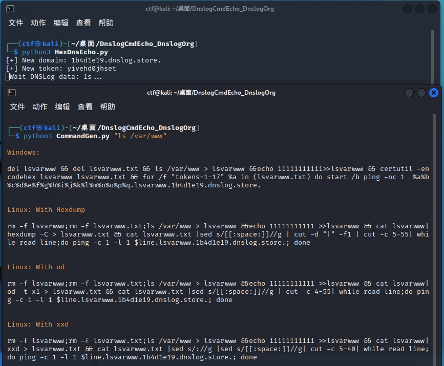
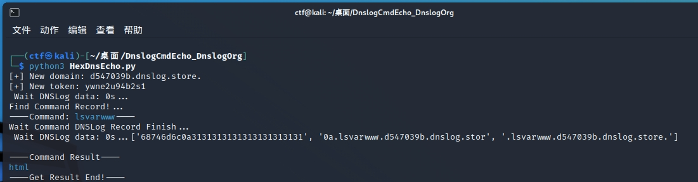

# DnslogCmdEcho_DnslogOrg
命令执行不回显但DNS协议出网的命令回显场景解决方案（回显平台更换为dnslog.org并优化）

# 使用
- python3 HexDnsEcho.py //本机执行
- python3 CommandGen.py whoami
- python3 CommandGen.py "ls /var/www" //将输出的对应命令在目标机器上执行

# Linux

# Windows

# 参考项目
- 以下项目为主要代码来源(感谢Dr-S1x17师傅分享的思路，以及sv3nbeast师傅对linux命令代码模板的填充)
- https://github.com/Dr-S1x17/NoNetCmdEcho-FileW.e
- https://github.com/sv3nbeast/DnslogCmdEcho
- 本项目主要是针对原本代码中的 "http://dig.pm/" 如今完全不适配的问题，进行了更换dns回显平台并修改了HexDnsEcho.py的相关代码
- 还于CommandGen.py中补充了当所需要执行的命令中含有空格情况下的处理
- 更新：参考了[HexDnsEchoT](https://github.com/A0WaQ4/HexDnsEchoT#2023-08-20-%E6%9D%A5%E8%87%AAr0fus0dno-github%E5%B8%88%E5%82%85%E7%9A%84%E6%9B%B4%E6%96%B0-%E6%94%AF%E6%8C%81odxxd)(感谢A0WaQ4与No-Github师傅)中的思路，增加linux中用od，xxd命令替换hexdump的命令输出
