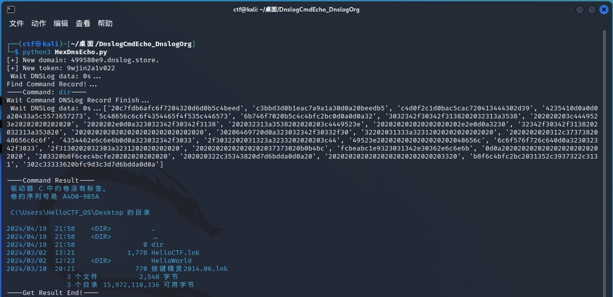

# DnslogCmdEcho_DnslogOrg
命令执行不回显但DNS协议出网的命令回显场景解决方案(回显更换为dnslog.org版本)

# 使用
- python3 HexDnsEcho.py //本机执行
- python3 CommandGen.py whoami
- python3 CommandGen.py "ls /var/www" //将输出的对应命令在目标机器上执行

# Linux

# Windows

# 参考项目
- 以下项目为主要代码来源(感谢Dr-S1x17师傅分享的思路，以及sv3nbeast师傅对linux命令代码模板的填充)
- https://github.com/Dr-S1x17/NoNetCmdEcho-FileW.e
- https://github.com/sv3nbeast/DnslogCmdEcho
- 本项目主要是针对原本代码中的 "http://dig.pm/" 如今完全不适配的问题，进行了更换dns回显平台并修改了HexDnsEcho.py的相关代码
- 还于CommandGen.py中补充了当所需要执行的命令中含有空格情况下的处理